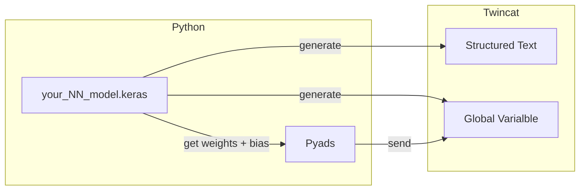

# PYNN2PLC
## Description
This is a toolbox which can convert the tensorflow neural network model into the Structured Text.


## Project status
```
Date: 04. April  2024
1. Support only dense neural network
2. Limited usage of activation function: relu & tanh
```

